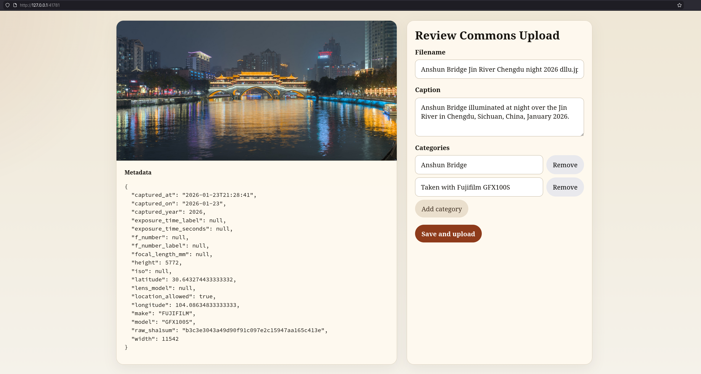

# pupphoto
some random scripts to organize my photos

Install dependencies with:

```bash
uv sync
```

Project configuration now lives in `config.toml`. It is loaded through the typed dataclasses in `config.py`, so paths are represented as `pathlib.Path` and the old split config sources are gone.

Example `config.toml`:

```toml
[import]
camera_dir = "/mnt/camera/DCIM"
photo_destination = "/home/your-user/pictures/raw"
video_destination = "/home/your-user/videos"
supported_raw_formats = [".raf", ".dng", ".cr3", ".arw"]
supported_video_formats = [".mov", ".mp4", ".avi", ".mkv"]

[upload]
pictures_dir = "~/Pictures"
thumb_dir = "~/Pictures/thumbs"
rclone_destination = "b2:your-bucket"
public_base_url = "https://example.com"
blog_image_dir = "/home/your-user/proj/your-site/img"

[album]
template_path = "static/album_template.html"
output_dir = "/tmp"
rsync_destination = "your-host:/www/path"
public_base_url = "https://example.com/public"
max_workers = 12

[openai]
api_key = "sk-..."
vision_model = "gpt-5"
image_detail = "high"
downsized_max_dimension = 1600

[commons]
api_url = "https://commons.wikimedia.org/w/api.php"
username = "YourCommonsUsername"
password = "YourCommonsPassword"
author = "Your Name"
license_wikitext = "{{self|cc-by-sa-4.0}}"
filename_suffix = ""
search_limit_per_query = 8
max_candidate_categories = 40
max_parent_depth = 3
ui_host = "127.0.0.1"
quality_images_category = "Quality Images by YourCommonsUsername"
quality_images_scan_limit = 500

[[banned_areas]]
name = "home"
latitude = 37.26178
longitude = -121.9151247
radius_meters = 500
```

Run the scripts with `uv run python ...`:

```bash
uv run python import.py
uv run python upload_photo.py path/to/photo.jpg
uv run python upload_clipboard.py path/to/photo.jpg
uv run python upload_blog.py path/to/photo.jpg
uv run python albumize.py path/to/photo1.jpg path/to/photo2.jpg
uv run python open_gps_google_maps.py path/to/photo.jpg
uv run python upload_commons.py path/to/photo.jpg
uv run python tag_quality_images.py
```

`import.py` imports from the configured camera directory, stores photos and videos in the configured destinations, and renames files to date, original filename, and the SHA1 of the raw file. For example, `DSCF2300.JPG` and `DSCF2300.RAF` become `2023-10-01-11-36-11_DSCF2300_53e266aac66a4b9cb37380214334d15b58517061.jpg` and `2023-10-01-11-36-11_DSCF2300_53e266aac66a4b9cb37380214334d15b58517061.raf`.

`upload_commons.py` opens a local review UI on a randomized localhost port, proposes a filename, caption, and candidate Commons categories with the OpenAI Responses API plus Wikimedia Commons category search, and only uploads after you press the button. Configure OpenAI credentials, Commons credentials, author name, filename suffix, and license in `config.toml`.

`tag_quality_images.py` scans your recent Commons uploads in batches, looks for file pages containing `{{QualityImage}}`, appends the configured `commons.quality_images_category` when missing, and stops as soon as it encounters a quality image that already has that category. Configure `commons.quality_images_category` and `commons.quality_images_scan_limit` in `config.toml`.

## Screenshot


